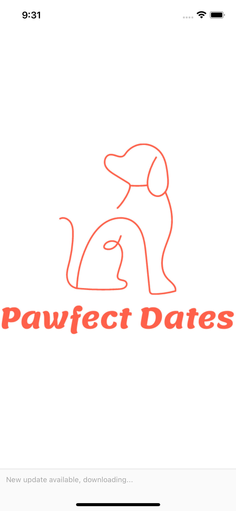
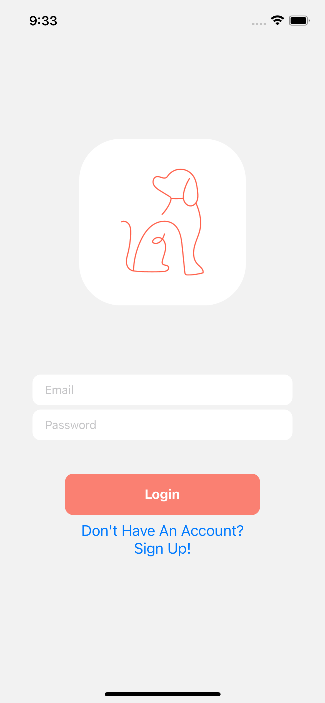
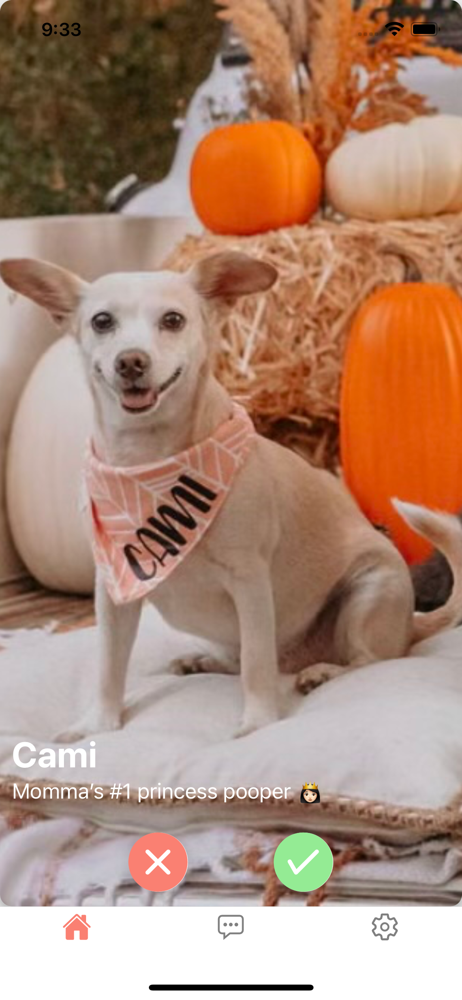

# Pawfect Dates

So, you just got your first puppy and you can’t wait to introduce them to the world, but you’re not sure where to start? Or perhaps you moved to a new city and are looking for ways to get involved in the local dog community? I wanted to create an app for those who are obsessed with their dogs. A place where they could swipe through and meet other owners in the area and potentially meet their dog’s new bestie! Pawfect Dates works very similar to Tinder, users can go through a database of potential matches and connect with those they think would be the best fit for their fur baby. This app is intended to help dog owners socialize their pups as well as connect with others in their community.

## Built With

For this project I worked with React Native and Firebase. React Native felt like the natural choice to make a fully responsive and user friendly mobile app. For my database and authentication I went with Google Firebase.  I chose this technology because of its noSQL structure that provides fast querying and allows for frequent application changes.  I used Firestore as my main database for storing user profile information and potential matches, and Storage for user profile pictures. 

[Pawfect Dates Demo](https://www.youtube.com/watch?v=8ozN1NMcCPQ)

### In the future..
This project was built, solo, in a little over two weeks’ time. With that in mind, I was not able to implement every aspect and functionality that I would have liked to. If I had more time, or perhaps if I pick this up again in the future a few things I would love to add would be:
   * Chat Functionality – allow users to chat with their matches, currently the app just displays the list of liked users.
   * Allow users to edit their profiles and add more than one photo.
   * Use the current location of the user to show potential matches nearby.

### Known Bugs

* The list of liked users does not load on the first render.
* There is an error on logout from an unmounted component.

